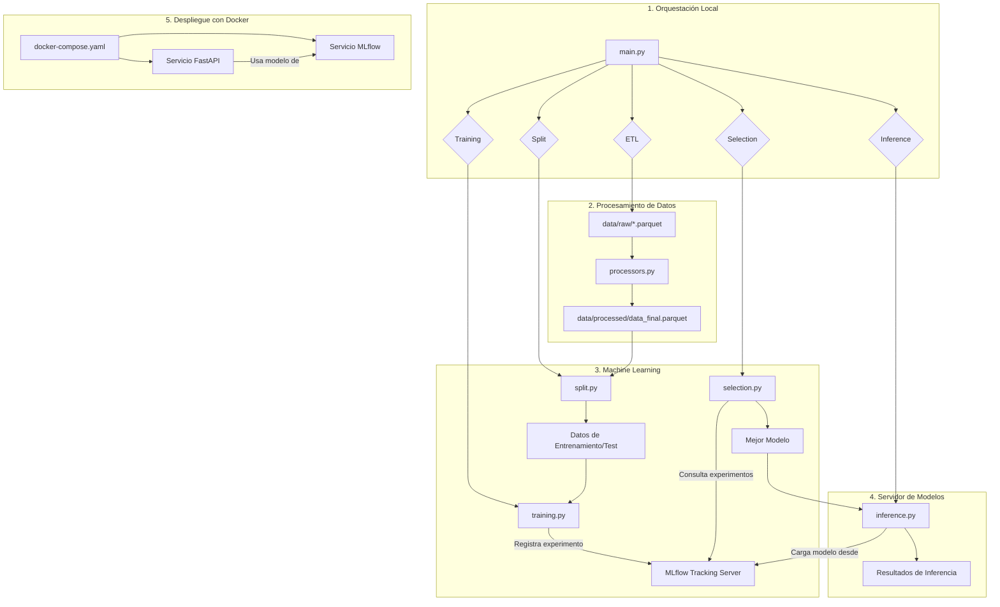

<!-- Sección de Calidad de Código eliminada: no implementada en este repositorio. -->
# 🤖 Apex Digital


Este proyecto es una solución a la prueba técnica de Data Science para Apex Digital. El objetivo es construir un pipeline de machine learning de extremo a extremo, desde el procesamiento de datos y entrenamiento de modelos hasta el despliegue de una API de inferencia con seguimiento de experimentos.

## 📋 Tabla de Contenidos

- [🚀 Características Principales](#-características-principales)
- [🏗️ Arquitectura del Pipeline](#-arquitectura-del-pipeline)
- [📁 Estructura del Proyecto](#-estructura-del-proyecto)
- [🛠️ Stack Tecnológico](#-stack-tecnológico)
- [📋 Prerrequisitos](#-prerrequisitos)
- [⚙️ Instalación y Configuración](#-instalación-y-configuración)
- [🚀 Uso](#-uso)
- [📊 Monitoreo y Logging](#-monitoreo-y-logging)
- [🚢 Despliegue](#-despliegue)
- [🎯 Enfoque](#-enfoque)
- [🧾 Hallazgos](#-hallazgos)
- [🔧 Mejoras](#-mejoras)
- [📈 Resultados de Inferencia](#-resultados-de-inferencia)
- [🤝 Cómo Contribuir](#-cómo-contribuir)
- [📄 Licencia](#-licencia)

## 🚀 Características Principales

- **📊 Pipeline ETL Completo**: Scripts para extracción, transformación y carga de datos desde archivos Parquet.
- **🤖 Entrenamiento y Selección de Modelos**: Proceso automatizado para entrenar múltiples modelos de clasificación y seleccionar el mejor basado en métricas.
- **🔍 Seguimiento de Experimentos con MLflow**: Registro detallado de parámetros, métricas y artefactos de cada ejecución.
- **⚡ API de Inferencia con FastAPI**: Servicio web asíncrono para realizar predicciones en tiempo real.
- **🐳 Contenerización con Docker**: Despliegue reproducible y aislado de la API y la interfaz de MLflow usando Docker Compose.
- **🛠️ Automatización con Makefile**: Comandos simplificados para ejecutar el pipeline, gestionar servicios y realizar tareas comunes.
 - **✅ Automatización con calidad de código (mejora pendiente)**: Actualmente no hay linters ni hooks configurados en el repositorio; ver la sección "Limitaciones y Posibles Mejoras" para recomendaciones.


## 🏗️ Arquitectura del Pipeline

El proyecto sigue un flujo de trabajo de MLOps estándar, desde los datos crudos hasta el servicio en producción. A continuación se detalla el flujo y las responsabilidades principales de cada componente:

- **ETL (Extract, Transform, Load)** 📥: Lee los archivos Parquet en `data/raw/`, aplica limpieza y transformaciones (gestión de nulos, codificación de categóricas) y escribe el dataset final en `data/processed/data_final.parquet`.
- **Split** ✂️: Divide el dataset procesado en conjuntos de entrenamiento y test (estratificado cuando aplica), manteniendo reproducibilidad con semillas controladas en `split.py`.
- **Training** 🏋️: Entrena una colección de modelos candidatos usando `training.py`, registra parámetros y métricas en MLflow y guarda artefactos (modelos serializados) en el store configurado.
- **Selection** 🏆: Lee los resultados en MLflow y selecciona el mejor modelo según la métrica objetivo (por defecto F1 score). El modelo seleccionado se marca como `best` o se versiona según la estrategia configurada en `selection.py`.
- **Inference** 🔮: Servicio ligero que carga el modelo seleccionado y expone una interfaz para recibir datos y devolver predicciones. Optimizado para baja latencia y registra tiempos de procesamiento por petición.
- **FastAPI** ⚡: Aplica validación de entrada (Pydantic), endpoints para inferencia en tiempo real y un endpoint de salud / métricas. Contenerizado para despliegue.




<!-- Diagrama de arquitectura eliminado: no se renderizaba correctamente en Markdown. -->

---

## 📁 Estructura del Proyecto

```
Apex_Digital/
├── config/                   # ⚙️ Archivos de configuración (logger, settings)
├── data/                     # 📊 Datos crudos y procesados
├── deployment/               # 🐳 Archivos para despliegue (Dockerfiles)
├── docs/                     # 📚 Documentación adicional
├── logs/                     # 📝 Archivos de logging
├── notebooks/                # 📓 Jupyter notebooks para exploración (EDA)
├── src/                      # 🐍 Código fuente del proyecto
│   ├── serving/              # ⚡ Lógica de la API FastAPI
│   ├── utils/                # 🛠️ Funciones y clases de utilidad
│   ├── elt.py                # 🔄 Script para ETL
│   ├── split.py              # 🔪 Script para división de datos
│   ├── training.py           # 🏋️ Script para entrenamiento de modelos
│   ├── selection.py          # 🏆 Script para selección del mejor modelo
│   └── inference.py          # 🔮 Script para inferencia
├── main.py                   # 🚀 Orquestador principal del pipeline
├── Makefile                  # 🛠️ Comandos de automatización
├── pyproject.toml            # 📦 Configuración del proyecto y dependencias
├── README.md                 # 📖 Esta documentación
└── ...
```

## 🛠️ Stack Tecnológico

### Backend & Machine Learning
- **🐍 Python 3.11**: Lenguaje principal del proyecto.
- **⚡ FastAPI**: Framework web para construir la API de inferencia.
- **🤖 Scikit-learn**: Librería fundamental para los modelos de machine learning.
- **📊 Pandas & PyArrow**: Para manipulación y procesamiento de datos eficiente.
- **🔍 MLflow**: Para el seguimiento de experimentos, versionado de modelos y despliegue.
- **Pydantic**: Para la validación de datos en la API.

### Contenerización & DevOps
- **🐳 Docker & Docker Compose**: Para crear, gestionar y orquestar los servicios en contenedores.
- **UV**: Instalador y gestor de paquetes Python ultra-rápido.
- **Makefile**: Para automatizar tareas repetitivas de desarrollo y despliegue.


## 📋 Prerrequisitos

Asegúrate de tener instalado lo siguiente en tu sistema:
- **Python 3.11+**
- **Docker & Docker Compose**
- **Git**
- **`uv`** (recomendado para la gestión de dependencias): `pip install uv`

## ⚙️ Instalación y Configuración

1.  **Clonar el repositorio:**
    ```bash
    git clone <URL_DEL_REPOSITORIO>
    cd Apex_Digital
    ```

2.  **Crear y activar un entorno virtual:**
    Se recomienda usar `uv` por su velocidad.
    ```bash
    uv venv
    source .venv/bin/activate
    ```
    *(En Windows, usa: `.venv\Scripts\activate`)*

3.  **Instalar dependencias:**
    ```bash
    uv pip install -r requirements.txt
    ```

4.  **Notas sobre configuración y secretos (mejora recomendada):**
    Actualmente el repositorio no incluye un archivo de configuración para variables de entorno ni gestión de secretos. Para producción recomendamos usar un gestor de secretos (Azure Key Vault, HashiCorp Vault) y definir variables de entorno en la configuración del despliegue.

## 🚀 Uso

### Ejecución del Pipeline Completo
Para ejecutar todos los pasos del pipeline (ETL, split, training, selection, inference) en secuencia:
```bash
make run
# O directamente:
python main.py
```

### Ejecución con Docker (Recomendado)
Esto levantará la API de FastAPI y la interfaz de MLflow en contenedores.
```bash
make up
```
Servicios disponibles:
- **API de FastAPI**: `http://localhost:8008/docs`
- **UI de MLflow**: `http://localhost:5000`

### Comandos del Makefile
-   **`make run`**: Ejecuta el pipeline principal localmente.
-   **`make train`**: Ejecuta solo el paso de entrenamiento.
-   **`make mlflow-ui`**: Inicia la interfaz de usuario de MLflow localmente.
-   **`make up`**: Levanta los servicios de Docker (FastAPI y MLflow).
-   **`make down`**: Detiene y elimina los contenedores de Docker.
-   **`make logs`**: Muestra los logs de los servicios en ejecución.
 -   **`make format`**: (No implementado) Formateo automático recomendado.
 -   **`make lint`**: (No implementado) Linting recomendado.

## 📊 Monitoreo y Logging

### Logs de la Aplicación
Los logs generados por la aplicación se guardan en `logs/app.log`. Puedes verlos en tiempo real:
```bash
tail -f logs/app.log
```

### Logs de Docker
Para monitorear los servicios que corren en Docker:
```bash
make logs
# Para un servicio específico:
docker compose logs -f fastapi_service
docker compose logs -f mlflow_service
```

### Interfaz de MLflow
Accede a `http://localhost:5000` para ver y comparar todos los experimentos, métricas y modelos entrenados.

<!-- Sección de Calidad de Código eliminada: no implementada en este repositorio. -->

## 🚢 Despliegue

El despliegue se gestiona a través de Docker, lo que garantiza un entorno consistente.

1.  **Construir las imágenes de Docker:**
    ```bash
    docker compose build
    ```

2.  **Levantar los servicios:**
    ```bash
    make up
    ```

Los archivos `Dockerfile` para cada servicio se encuentran en la carpeta `deployment/`:
-   `deployment/fastapi/Dockerfile`: Para la API de inferencia.
-   `deployment/mlflow/Dockerfile`: Para el servicio de MLflow.

El archivo `docker-compose.yaml` orquesta el despliegue de estos servicios.

## 🎯 Enfoque

El proyecto sigue un enfoque MLOps implementado y orquestado por `main.py`. A continuación se describen, de forma concisa y responsable, las responsabilidades y pasos que el código ejecuta:

- **MLflow & Experimentos**: `main.py` configura `MLFLOW_TRACKING_URI`, asegura el experimento (`ensure_experiment`) y abre un `mlflow.start_run` (`async_inference_run`) para centralizar el logging de parámetros, métricas y artefactos.
- **ELT (Extracción, Limpieza y Carga)**: Se usa `ELTPipeline` (`src.elt`) para leer `data/raw/`, aplicar las transformaciones necesarias (p. ej. `dtype_map`) y escribir el dataset procesado en `data/processed/`.
- **Split reproducible**: División `train/val/test` mediante `split_train_val_test` con semilla fija para reproducibilidad; el target principal es `canal_pedido_cd`.
- **Selección y alineado de features**: `feature_selection` garantiza que `X_train`, `X_val`, `X_test` compartan el mismo conjunto y orden de columnas antes de entrenar.
- **Entrenamiento y registro de modelos (XGBoost)**: El pipeline de entrenamiento (`train_models`) entrena un **XGBoost (XGBClassifier)** como modelo principal, con opciones aplicadas desde `main.py` (por ejemplo `use_balanced_weights`, `use_gpu`, `early_stopping_rounds`). Los runs registran métricas y artefactos en MLflow y el modelo queda asegurado en el Model Registry (nombre por defecto `digital_orders_xgboost`).
- **Garantizar modelo en Registry**: La función `ensure_model_available` verifica que exista al menos una versión registrada; si no, dispara el entrenamiento (`train_models`) y vuelve a validar.
- **Inferencia asíncrona y pruebas**: Se prepara una muestra de test (`prepare_test_sample`) y se lanza `run_async_inference` con concurrencia (`max_concurrent`) para medir latencia, tasa de éxito y confianza. El flujo es asíncrono para simular cargas reales y medir tiempos de procesamiento.
- **Métricas y artefactos de inferencia**: El código agrega métricas agregadas a MLflow (`inference_samples`, `inference_total_time_ms`, `inference_avg_time_ms`, `inference_success_rate`), logs por-clase (`pred_count_<class>`), estadísticas de confianza y guarda archivos JSON (`inference_results.json`, `inference_distributions.json`) como artefactos.
- **Alineado y logging legible**: Internamente se usa una utilidad para alinear la distribución de `ground_truth` con la de predicciones (`_align_dict_like`) para reporting claro en logs y artefactos.
- **Orquestación end-to-end**: `main.py` actúa como orquestador único (ELT → split → feature selection → entrenamiento/registro → inferencia → logging), permitiendo ejecutar el pipeline completo con reproducibilidad y trazabilidad.

## 🧾 Hallazgos

- **Resumen del rendimiento del modelo:** val_logloss observado ≈ 1.04862 (métricas de validación registradas durante entrenamiento en `src/training.py` y replicadas en `logs/app.log`).
- **Tamaño y preparación de datos:** ELT produjo un dataset concatenado de 1,250,000 registros que se redujo a 149,960 clientes únicos; promedio ~8.3 registros/cliente; archivo procesado guardado en `data/processed/data_final.parquet`.
- **Split de datos:** Train = 89,976 / Val = 29,992 / Test = 29,992 (ver entradas de `logs/app.log`).
- **Features finales usadas:** 8 features finales tras selección automática: `['pais_cd', 'tipo_cliente_cd', 'madurez_digital_cd', 'estrellas_txt', 'frecuencia_visitas_cd', 'cajas_fisicas', 'fecha_pedido_dt_day_of_week', 'fecha_pedido_dt_quarter']` (ver `src/selection/feature_selection.py` y logs).
- **Comportamiento en inferencia (resumen cuantitativo):**
    - Muestras procesadas en tests end-to-end: 50 por corrida (varias ejecuciones).
    - Latencia: promedio por predicción entre ~14.5ms y ~16.7ms (ejecuciones en logs); ejemplo agregado: promedio global ≈ 15ms/predicción.
    - Confianza promedio por ejecución: observada entre ~0.486 y ~0.547; valor medio de ejemplos leídos ≈ 0.51.
- **Distribución de clases — sesgos observados:**
    - Predicciones (ejemplo agregado): `DIGITAL` frecuentemente sobre-predicho respecto al ground truth; `VENDEDOR` tiende a estar sub-predicho.
    - Ejemplo desde `inference_distributions.json`: `predictions = {'TELEFONO': 17, 'DIGITAL': 28, 'VENDEDOR': 5}` vs `ground_truth_aligned = {'TELEFONO': 10, 'DIGITAL': 24, 'VENDEDOR': 16}` — sugiere sobre-predicción de `DIGITAL` y déficit en `VENDEDOR`.
- **Éxito operacional:** Inferencias batch muestran success rate 100% en runs observadas; modelo cargado desde registry `models:/digital_orders_xgboost/2` (logs de `src/inference/initialize`).
- **Limitaciones detectadas (evidencia):**
    - Métrica de validación (logloss) relativamente alta → modelo puede no estar listo para producción sin calibración adicional o features más informativas.
    - Desbalance en predicciones vs ground truth por clase — riesgo de sesgo que requiere revisión de clases, weights o muestreo.
    - Feature selection eliminó columnas potencialmente informativas (`facturacion_usd_val`, `materiales_distintos_val`) por correlación baja o alta multicolinealidad — revisar con input de negocio.
- **Acciones recomendadas (corto/medio plazo):**
    - Re-evaluar balance de clases (re-muestreo o `class_weight`) y/o ajustar thresholds por clase.
    - Calibrar probabilidades (Platt scaling / isotonic) si se requiere confianza probabilística robusta.
    - Revisar variables eliminadas por selección automática para confirmar si su eliminación es apropiada desde el negocio.
    - Añadir métricas de clasificación por clase (precision/recall/F1, matriz de confusión) en el pipeline de evaluación y en los artifacts de MLflow.
- **Dónde encontrar la evidencia:**
    - Logs: `logs/app.log` (ejecuciones que muestran ELT, split, feature selection, inferencia y métricas).
    - Artefactos de inferencia: `inference_results.json`, `inference_distributions.json` (muestras de predicciones, confidencias y latencias).
    - Código: `src/training.py`, `src/selection/feature_selection.py`, `src/inference/*`, `main.py`.
- **Diagrama de arquitectura:**
    - Archivo: `docs/architecture.png` (convertido desde SVG para compatibilidad con renderizado).

## 🔧 Mejoras

- **Rendimiento del Modelo**: El modelo actual (XGBoost) es un buen punto de partida. Siguientes pasos recomendados:
    - **Ingeniería de Características Avanzada**: Crear nuevas variables que capturen mejor las relaciones en los datos.
    - **Explorar alternativas y ensamblados**: Probar LightGBM, CatBoost o ensamblados (stacking/blending) que pueden complementar XGBoost.
    - **Optimización de Hiperparámetros**: Realizar una búsqueda más exhaustiva (ej. con Optuna o Hyperopt, integrados con MLflow) y usar técnicas como cross-validation más robustas.
- **Falta de Pruebas (Testing)**: El proyecto carece de una suite de tests unitarios y de integración. Añadir pruebas es **crítico** para asegurar la fiabilidad del código, validar los datos y prevenir regresiones.
- **Seguridad**: El código actual no gestiona secretos de forma segura. En un entorno productivo, las credenciales y claves de API deberían ser gestionadas a través de un sistema como Azure Key Vault o HashiCorp Vault, en lugar de estar expuestas.
- **Automatización (CI/CD)**: El pipeline se ejecuta manualmente. El siguiente paso sería implementar un sistema de Integración y Despliegue Continuo (CI/CD) con herramientas como GitHub Actions para automatizar la ejecución del pipeline ante nuevos commits.
- **Monitoreo en Producción**: La monitorización actual se limita a logs. Un sistema productivo requeriría un monitoreo activo del modelo para detectar **deriva de datos (data drift)** y **degradación del rendimiento del modelo (model degradation)**.

## 📈 Resultados de Inferencia

- Total predicciones: **50**
- Tiempo medio de procesamiento por petición: **15.03 ms**
- Tiempo mediano de procesamiento: **14.79 ms**
- Confianza media: **0.511**
- Confianza mediana: **0.489**

- Conteo por clase:
    - **TELEFONO**: 17
    - **DIGITAL**: 28
    - **VENDEDOR**: 5

- Confianza media por clase:
    - **TELEFONO**: 0.4022
    - **DIGITAL**: 0.5993
    - **VENDEDOR**: 0.3854

- Clase más frecuente: **DIGITAL** (28 predicciones)

## 🤝 Cómo Contribuir

Las contribuciones son bienvenidas. Por favor, sigue estos pasos:
1.  Haz un **Fork** de este repositorio.
2.  Crea una nueva **rama** (`git checkout -b feature/nueva-funcionalidad`).
3.  Realiza tus cambios y haz **commit** (`git commit -m 'Añadir nueva funcionalidad'`).
4.  Asegúrate de que el código pasa las verificaciones de calidad (`make format` y `make lint`).
5.  Haz **Push** a tu rama (`git push origin feature/nueva-funcionalidad`).
6.  Abre un **Pull Request**.

## 📄 Licencia

Este proyecto está bajo la Licencia MIT. Consulta el archivo `LICENSE` para más detalles.
